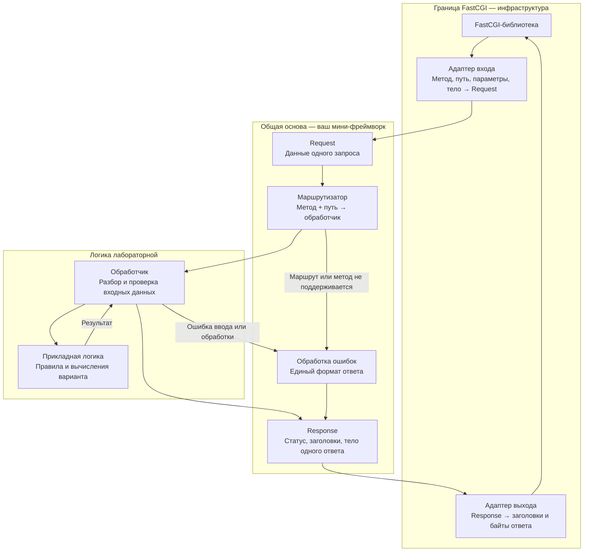
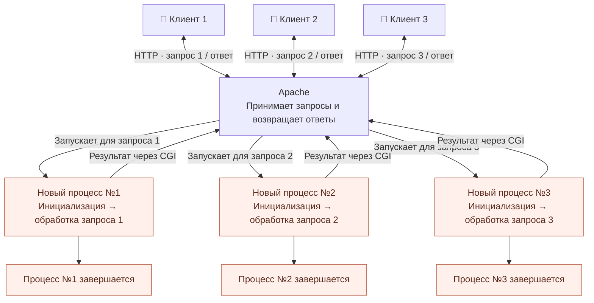
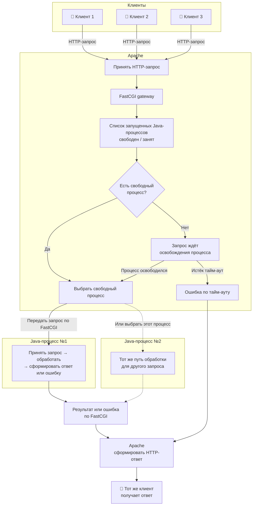

# Web: как делать и сдавать лабораторные

**Памятка студентам · ИТМО.** Цель — научиться делать веб-приложения, понимать путь запроса от браузера до серверного кода и проектировать решения, которые можно развивать. Работающий сайт — только начало защиты.

## 1. Получите вариант

Перед **каждой лабораторной** заранее получите вариант у Максима. **Сразу сделайте фото или скриншот своего варианта с текстом задания и вставьте в отчёт — это обязательно.** Прочитайте задание курса: стек, ограничения и операции зависят от работы и варианта. Самовольно заменять технологии нельзя.

Сейчас в курсе **три лабораторные работы**. Ниже разобраны ожидания от вёрстки и серверной части на FastCGI. Подробные требования ко всем трём работам смотрите в заданиях курса.

## 2. Подготовьте работу

Выполните и проверьте **каждый пункт задания без исключений**. Подготовьте отчёт, UML и исходники.

**Сначала разбирайтесь сами и с одногруппниками.** Обсуждайте решения и опыт защиты: что проверяли, как ломали, какие вопросы задавали. Это часть подготовки и развития навыков общения. К преподавателю обращайтесь, если вопрос остался: опишите, что уже выяснили и в чём сомневаетесь. Прямо предусмотренные заданием согласования обязательны — приходите с подготовленным предложением.

До занятия проверьте запуск приложения и основные сценарии целиком. Для серверной части проверьте отправку запросов и получение ответов. **Установите Postman (предпочтительно) или аналог; заранее сохраните запросы, тестовые данные и сценарии в коллекцию**, чтобы на защите не собирать их вручную с нуля.

Если предусмотрен деплой на Helios — выполните его. Иной формат заранее согласуйте с преподавателем в личных сообщениях и обоснуйте.

## 3. Покажите работоспособность

Покажите все требования варианта. Проверяем также некорректный ввод, граничные значения, нескольких пользователей и предусмотренные заданием сбои. Для вёрстки покажите страницу при разных размерах экрана.

Пользователь может ошибаться, намеренно ломать систему или просто пользоваться ею. Нужны понятные поля, подсказки и ошибки. В серверной работе проверяйте ввод на сервере: форму можно обойти. Не допускайте XSS и утечек секретов, сохраняйте удобство интерфейса. Если работа использует БД, соблюдайте её ограничения и защищайтесь от SQL-инъекций.

## 4. Объясните свой код

Объясните любой метод, класс, модуль и аннотацию: зачем нужны, как работают, что изменится при удалении, какие границы и как проверены. Это касается и HTML, CSS, JavaScript: нужно понимать разметку, стили и поведение страницы. Обоснуйте архитектуру, валидацию и работу с данными.

За каждую строку отвечаете вы. Нужно предсказывать и объяснять поведение программы.

## 5. Используйте ИИ осознанно

**Мы поддерживаем использование ИИ и ИИ-агентов.** Изучайте, проверяйте и понимайте полученный код. Если вы сгенерировали лабораторную одним промптом и пришли сдавать, не разобравшись в результате, проверка будет особенно строгой: будем спрашивать по каждому файлу, что он делает и зачем нужен.

**Если выяснится, что вы совсем не понимаете код, работу системы и смысл своего решения, мы сменим вам вариант — лабораторную придётся делать заново.**

## 6. Решите, берёте ли доп

Чем раньше сдаёте, тем больше баллов можете получить. После успешной проверки своевременно сданной работы преподаватель может предложить сложный доп по архитектуре или веб-технологиям. Потребуется изучить, реализовать и обосновать решение.

Можно отказаться и перейти к теории, потеряв баллы. **Взяли доп — сначала выполните и защитите его; сразу сдавать теорию нельзя.**

## 7. Закройте замечания и сдайте теорию

На ревью часто обнаруживаются ошибки архитектуры, баги и проблемы производительности. Незначительные замечания преподаватель может допустить. **Обязательные замечания — обычно их большинство — нужно исправить.** Какие замечания блокируют приёмку, уточняем на защите; требования задания остаются обязательными.

Чтобы не ждать следующего занятия две недели, преподаватель может разрешить **онлайн-досдачу исправлений через GitHub** после очной проверки. Подготовьте проект так:

- Каждая лабораторная — отдельный проект в GitHub. Ветка **`main` остаётся пустой, без кода лабораторной**.
- Код пишите в отдельной ветке и откройте из неё **Pull Request в `main`**. Присылайте ссылку на PR; в описании перечислите закрытые замечания.
- **Одно логическое исправление — один законченный коммит с понятным названием.** Не объединяйте все замечания в один коммит и не дробите одну правку на десятки промежуточных.

Теория — после принятия всех обязательных исправлений и допа, если вы его взяли. Готовьте список с SE.IFMO, Java, свой стек и архитектуру. Вопросы могут выходить за список и касаться вашего кода.

## 8. Проверьте баллы

Если баллы выставлены неверно, отметьте Максима в группе или напишите ему лично: **ФИО, группа, какая работа, когда и кому сдавали, что не сходится**.

## 9. Что ожидаем от вёрстки

Первая лабораторная — вёрстка по заданным требованиям. Нужны:

- **Аккуратный, красивый интерфейс:** согласованные цвета, шрифты и отступы, читаемый текст, понятные элементы управления.
- **Осмысленные HTML и CSS:** подходящие элементы разметки, требуемые заданием стили и способы их применения.
- **Адаптивность:** страница остаётся удобной на узком, среднем и широком экране; элементы не перекрываются и не выходят за границы.

Использование CSS-препроцессоров, например Sass/SCSS, приветствуется, если совместимо с заданием. Нужно понимать, как из исходников получается CSS для браузера. Сам по себе дополнительный инструмент не заменяет качество вёрстки.

## 10. Какую архитектуру мы хотим видеть

**Приветствуем небольшой расширяемый фреймворк.** Схема — ориентир по ответственности, названия классов выбираете сами.

- **В `main` — сборка и запуск.** Вычисления и обработку запросов вынесите в отдельные компоненты; зависимости передавайте через конструкторы.
- **Без прикладного кода на `static`-методах и полях.** Исключения — точка входа и неизменяемые константы. Особенности FastCGI-библиотеки изолируйте в адаптере.
- **Данные запросов не смешиваются.** Не храните текущий запрос или ответ в общем объекте; историю, если она нужна по заданию, выделите в отдельное хранилище.
- **Расширение — локальное.** Новая ручка не требует переписывать транспорт; форматирование ответов и обработка ошибок остаются общими.

**На защите:** проведите запрос по схеме своего кода, покажите добавление ручки и проверьте последовательность «корректный → ошибочный → корректный запрос».

## 11. Инфосправка: CGI и FastCGI на схемах

### CGI — новый процесс приложения на каждый запрос

### FastCGI — запущенный процесс обслуживает следующие запросы

На схеме показаны два уже запущенных Java-процесса. Их количество зависит от конфигурации.

